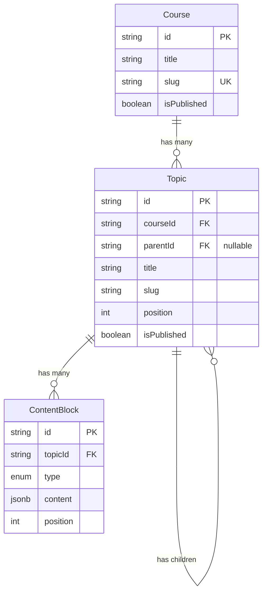

# Phase 1: Content Architecture for Allml Learning Platform

Build the foundational database schema for publicly accessible educational tutorials using PostgreSQL, Prisma, and Express.js.

---

## 1. Complete Prisma Schema

```prisma
generator client {
  provider = "prisma-client-js"
}

datasource db {
  provider = "postgresql"
  url      = env("DATABASE_URL")
}

// ─────────────────────────────────────────────
// COURSE
// ─────────────────────────────────────────────

model Course {
  id             String    @id @default(cuid())
  title          String                          // Display title: "Agentic AI"
  slug           String    @unique               // URL-safe: "agentic-ai"
  description    String?   @db.Text              // Long-form course description
  coverImage     String?                         // URL to cover image in object storage

  // SEO overrides (explained below)
  seoTitle       String?                         // Override for <title> tag
  seoDescription String?                         // Override for <meta name="description">
  ogImage        String?                         // Override for og:image

  isPublished    Boolean   @default(false)
  publishedAt    DateTime?
  createdAt      DateTime  @default(now())
  updatedAt      DateTime  @updatedAt

  // Relations
  topics         Topic[]

  // Indexes
  @@index([isPublished])
  @@index([createdAt])

  @@map("courses")
}

// ─────────────────────────────────────────────
// TOPIC (self-referencing for unlimited nesting)
// ─────────────────────────────────────────────

model Topic {
  id             String    @id @default(cuid())
  title          String                          // Display title: "What is RAG?"
  slug           String                          // URL segment: "what-is-rag"
  description    String?   @db.Text              // Brief summary shown in listings
  position       Int       @default(0)           // Ordering among siblings

  // SEO overrides
  seoTitle       String?
  seoDescription String?
  ogImage        String?

  isPublished    Boolean   @default(false)
  publishedAt    DateTime?
  createdAt      DateTime  @default(now())
  updatedAt      DateTime  @updatedAt

  // ── Course relation ──
  courseId        String
  course          Course   @relation(fields: [courseId], references: [id], onDelete: Cascade)

  // ── Self-referencing parent/children ──
  parentId        String?
  parent          Topic?   @relation("TopicHierarchy", fields: [parentId], references: [id], onDelete: Cascade)
  children        Topic[]  @relation("TopicHierarchy")

  // ── Content blocks ──
  contentBlocks   ContentBlock[]

  // Constraints & Indexes
  @@unique([courseId, parentId, slug], name: "unique_slug_within_parent")
  @@index([courseId])
  @@index([parentId])
  @@index([courseId, parentId, position])
  @@index([isPublished])

  @@map("topics")
}

// ─────────────────────────────────────────────
// CONTENT BLOCK (generic, JSONB-powered)
// ─────────────────────────────────────────────

enum ContentBlockType {
  TEXT
  IMAGE
  VIDEO
  CODE
  CALLOUT
  TABLE

  @@map("content_block_type")
}

model ContentBlock {
  id        String           @id @default(cuid())
  type      ContentBlockType
  content   Json             @db.JsonB            // Flexible payload per type
  position  Int              @default(0)          // Ordering within a topic

  createdAt DateTime         @default(now())
  updatedAt DateTime         @updatedAt

  // ── Topic relation ──
  topicId   String
  topic     Topic            @relation(fields: [topicId], references: [id], onDelete: Cascade)

  // Indexes
  @@index([topicId, position])

  @@map("content_blocks")
}
```

---

## 2. Model-by-Model Explanation

### Course

The top-level container. Each Course groups a set of related Topics into a coherent learning path.

| Field | Purpose |
|-------|---------|
| `id` | CUID primary key — URL-safe, globally unique, non-sequential (no information leakage) |
| `title` | Human-readable display title shown in headings, cards, breadcrumbs |
| `slug` | URL segment used in routes (`/courses/agentic-ai`). Globally `@unique` because course slugs live at the top of the URL hierarchy |
| `description` | Long-form description (`@db.Text` removes the 255-char default) |
| `coverImage` | URL string pointing to external/object storage (S3, Cloudinary, etc.) |
| `seoTitle` / `seoDescription` / `ogImage` | SEO overrides — explained in detail in Section 5 |
| `isPublished` / `publishedAt` | Draft/publish workflow. `publishedAt` is set explicitly when publishing, allowing scheduled publishing and "published 3 months ago" displays |
| `createdAt` / `updatedAt` | Automatic timestamps |
| `topics` | One-to-many relation — a Course has many Topics |

### Topic

The workhorse model. Each Topic is simultaneously:
- A **node in a tree** (via self-referencing `parent`/`children`)
- A **tutorial page** (via its `contentBlocks`)

| Field | Purpose |
|-------|---------|
| `id` | CUID primary key |
| `title` / `slug` / `description` | Same semantics as Course |
| `position` | Integer for ordering siblings. Topics with the same parent are sorted by `position` |
| `courseId` | Foreign key — every Topic belongs to exactly one Course |
| `parentId` | **Nullable** foreign key to another Topic. `null` = top-level topic directly under the course |
| `parent` / `children` | The self-referencing relation pair (explained in Section 3) |
| `contentBlocks` | One-to-many — the actual tutorial content |

### ContentBlock

A generic, polymorphic content unit. Instead of separate `TextBlock`, `ImageBlock`, `VideoBlock` tables, we use a single table with a `type` discriminator and a flexible JSONB `content` column.

| Field | Purpose |
|-------|---------|
| `id` | CUID primary key |
| `type` | Enum discriminator — tells the frontend how to render the block |
| `content` | JSONB payload — structure varies by type (see examples below) |
| `position` | Ordering within the parent Topic |
| `topicId` | Foreign key — every block belongs to exactly one Topic |

**Why this design?**
- **Extensibility**: Adding a new block type (e.g., `QUIZ`, `DIAGRAM`) requires only adding an enum value — no schema migration for new tables.
- **Simplicity**: One table, one query pattern, one API shape.
- **PostgreSQL JSONB**: Supports indexing, querying, and validation at the database level if needed later.
- **Tradeoff acknowledged**: We lose column-level database constraints on the JSON payload. This is acceptable because content validation should happen at the application/API layer anyway (with Zod, Joi, etc.), and the flexibility gained far outweighs the cost for a CMS-like content model.

---

## 3. The Self-Referencing Topic Relationship

```
Topic
  ├── parentId  → Topic.id  (nullable FK)
  ├── parent    → Topic?    (@relation, many-to-one)
  └── children  → Topic[]   (@relation, one-to-many)
```

This is called an **adjacency list** pattern — the most common way to model trees in relational databases.

### How it works

```
Agentic AI (Course)
├── Introduction          (parentId: null,  courseId: "course_1")
├── AI Agents             (parentId: null,  courseId: "course_1")
├── RAG                   (parentId: null,  courseId: "course_1")
│   ├── What is RAG?      (parentId: "rag", courseId: "course_1")
│   ├── Embeddings        (parentId: "rag", courseId: "course_1")
│   └── Vector Databases  (parentId: "rag", courseId: "course_1")
├── Agent Memory          (parentId: null,  courseId: "course_1")
└── Agent Evaluation      (parentId: null,  courseId: "course_1")
```

- **Top-level topics** have `parentId: null` — they are direct children of the Course.
- **Subtopics** have `parentId` pointing to their parent Topic's `id`.
- **Unlimited nesting**: A subtopic can itself be a parent. "Vector Databases" could have children like "Pinecone", "Weaviate", "ChromaDB" — with no schema changes.

### Why adjacency list (not nested sets, materialized paths, or closure tables)?

| Pattern | Pros | Cons |
|---------|------|------|
| **Adjacency list** ✅ | Simple, easy writes, easy Prisma relations | Recursive queries need multiple calls or recursive CTEs |
| Nested sets | Fast subtree reads | Expensive inserts/reorders — terrible for CMS content |
| Materialized path | Fast ancestor lookups | String manipulation, harder to maintain |
| Closure table | Fast reads for all relationships | Extra join table, complex writes |

For a tutorial website:
- Tree depth is shallow (typically 2–4 levels).
- Writes (reordering, adding topics) happen frequently in the CMS.
- Prisma doesn't natively support recursive CTEs, but it doesn't matter — shallow trees can be fetched with 2–3 queries or a single raw SQL recursive CTE when needed.

The adjacency list is the **right tradeoff** for this use case.

### `onDelete: Cascade`

When a parent Topic is deleted, all its children are automatically deleted. This prevents orphaned subtopics. The same applies to Course → Topic: deleting a course removes all its topics.

---

## 4. How Course → Topic → Subtopic → ContentBlock Works



**The data flow:**

1. A **Course** (e.g., "Agentic AI") is the entry point.
2. The Course has many **top-level Topics** (`parentId: null`) — "Introduction", "RAG", "Agent Memory", etc.
3. Each Topic can have **child Topics** — "RAG" has children "What is RAG?", "Embeddings", "Vector Databases".
4. Each Topic (whether top-level or nested) has **ContentBlocks** — the actual rendered content of the tutorial page.
5. ContentBlocks are ordered by `position` and rendered sequentially by the frontend.

**A single tutorial page** = one Topic + its ordered ContentBlocks.
**The sidebar/navigation** = the tree of Topics for a Course, built from the parent/children relationships.

---

## 5. SEO Fields: Why Separate from title/description?

> [!IMPORTANT]
> The `seoTitle`, `seoDescription`, and `ogImage` fields are **intentionally separate** from `title`, `description`, and `coverImage`. Here's why:

### Different audiences, different needs

| Field | Audience | Optimized for |
|-------|----------|---------------|
| `title` | Human readers on your site | Clarity, scannability, brand voice |
| `seoTitle` | Google SERP, browser tabs | 50–60 chars, includes keywords, click-through rate |
| `description` | On-page content | Can be long, detailed, educational |
| `seoDescription` | Google SERP snippet | 150–160 chars, compelling, action-oriented |
| `coverImage` | Your UI (hero banners, cards) | Any aspect ratio, brand-consistent |
| `ogImage` | Social shares (Twitter, LinkedIn, Discord) | 1200×630, text overlay, eye-catching |

### Example

```
title:          "RAG"
seoTitle:       "What is RAG? Retrieval Augmented Generation Explained | Allml"

description:    "Learn about Retrieval Augmented Generation, a technique
                 that enhances LLM responses by grounding them in external
                 knowledge sources."
seoDescription: "Master RAG in 10 minutes — learn how Retrieval Augmented
                 Generation makes LLMs accurate and up-to-date. Free tutorial."
```

### Why optional?

These fields are **optional** (`String?`) because:
1. **Sensible defaults**: The frontend/Next.js can fall back to `title` and `description` when SEO overrides aren't set. Most topics won't need custom SEO fields.
2. **Progressive SEO**: You can launch without SEO overrides and add them later for high-traffic pages.
3. **Content author experience**: Not every topic writer should need to think about SEO. The fields are there when the SEO team needs them.

**Frontend logic** (in Next.js `generateMetadata`):
```ts
// Pseudocode — not part of the schema
const pageTitle = topic.seoTitle || `${topic.title} | ${course.title} | Allml`;
const pageDescription = topic.seoDescription || topic.description || '';
const pageOgImage = topic.ogImage || course.ogImage || '/default-og.png';
```

---

## 6. Indexes and Unique Constraints

### Course indexes

| Index/Constraint | Fields | Why |
|------------------|--------|-----|
| `@unique` | `slug` | Course slugs form the first URL segment (`/courses/agentic-ai`). Must be globally unique. |
| `@@index` | `isPublished` | Filter queries: "give me all published courses." PostgreSQL can use this for partial index scans. |
| `@@index` | `createdAt` | Sorting: "newest courses first." |

### Topic indexes

| Index/Constraint | Fields | Why |
|------------------|--------|-----|
| `@@unique` | `[courseId, parentId, slug]` | **Critical**: A topic's slug only needs to be unique among its siblings — not globally. Two different courses can both have an "introduction" topic. Two different parent topics can both have a "basics" subtopic. This composite unique constraint enforces exactly that. It also enables the URL resolution strategy (see Section 8). |
| `@@index` | `courseId` | Fast lookup: "all topics for this course." |
| `@@index` | `parentId` | Fast lookup: "all children of this topic." |
| `@@index` | `[courseId, parentId, position]` | **The workhorse query**: "all siblings of a topic, ordered by position." This composite index serves both the filter (`courseId`, `parentId`) and the sort (`position`) in a single index scan. |
| `@@index` | `isPublished` | Filter published topics. |

### ContentBlock indexes

| Index/Constraint | Fields | Why |
|------------------|--------|-----|
| `@@index` | `[topicId, position]` | The primary query pattern: "all blocks for this topic, ordered by position." The composite index covers both the WHERE and ORDER BY. |

### Why `@@unique([courseId, parentId, slug])`?

This is the most important design decision in the schema. Consider the URL:

```
/courses/agentic-ai/rag/what-is-rag
```

To resolve this, the backend walks the URL segments:
1. Find Course where `slug = "agentic-ai"` → gets `courseId`
2. Find Topic where `courseId = X AND parentId IS NULL AND slug = "rag"` → gets the RAG topic
3. Find Topic where `courseId = X AND parentId = rag.id AND slug = "what-is-rag"` → gets the final topic

Each step hits the `@@unique([courseId, parentId, slug])` index. Fast, correct, and guarantees no ambiguity.

> [!NOTE]
> **Prisma and nullable unique fields**: In PostgreSQL, `NULL` values are considered distinct in unique indexes. This means `(courseId: "abc", parentId: NULL, slug: "intro")` and `(courseId: "abc", parentId: NULL, slug: "intro")` **would** correctly conflict. Two top-level topics with the same slug in the same course are correctly prevented.

---

## 7. Example Database Records

### Course: Agentic AI

```json
{
  "id": "clx1abc000001",
  "title": "Agentic AI",
  "slug": "agentic-ai",
  "description": "A comprehensive course on building AI agents, covering RAG, memory, evaluation, and more.",
  "coverImage": "https://cdn.allml.com/courses/agentic-ai/cover.webp",
  "seoTitle": "Agentic AI Course — Build Intelligent AI Agents | Allml",
  "seoDescription": "Learn to build production AI agents. Covers RAG, agent memory, tool use, and evaluation. Free tutorials with code examples.",
  "ogImage": "https://cdn.allml.com/courses/agentic-ai/og.png",
  "isPublished": true,
  "publishedAt": "2026-08-01T00:00:00.000Z",
  "createdAt": "2026-07-15T10:00:00.000Z",
  "updatedAt": "2026-08-01T00:00:00.000Z"
}
```

### Topic: RAG (top-level, under Agentic AI)

```json
{
  "id": "clx1abc000010",
  "title": "RAG",
  "slug": "rag",
  "description": "Retrieval Augmented Generation — grounding LLM responses in external knowledge.",
  "position": 2,
  "seoTitle": null,
  "seoDescription": null,
  "ogImage": null,
  "isPublished": true,
  "publishedAt": "2026-08-01T00:00:00.000Z",
  "courseId": "clx1abc000001",
  "parentId": null
}
```

URL: `/courses/agentic-ai/rag`

### Topic: What is RAG? (subtopic, under RAG)

```json
{
  "id": "clx1abc000011",
  "title": "What is RAG?",
  "slug": "what-is-rag",
  "description": "An introduction to Retrieval Augmented Generation and why it matters.",
  "position": 0,
  "seoTitle": "What is RAG? Retrieval Augmented Generation Explained | Allml",
  "seoDescription": "Understand Retrieval Augmented Generation (RAG) — how it works, why LLMs need it, and when to use it. Beginner-friendly tutorial with diagrams.",
  "ogImage": null,
  "isPublished": true,
  "publishedAt": "2026-08-01T00:00:00.000Z",
  "courseId": "clx1abc000001",
  "parentId": "clx1abc000010"
}
```

URL: `/courses/agentic-ai/rag/what-is-rag`

### ContentBlocks for "What is RAG?"

```json
[
  {
    "id": "clx1blk000001",
    "type": "TEXT",
    "content": {
      "text": "Retrieval Augmented Generation (RAG) is a technique that enhances Large Language Model responses by retrieving relevant information from external knowledge sources before generating an answer."
    },
    "position": 0,
    "topicId": "clx1abc000011"
  },
  {
    "id": "clx1blk000002",
    "type": "IMAGE",
    "content": {
      "url": "https://cdn.allml.com/courses/agentic-ai/rag/rag-architecture.webp",
      "alt": "RAG architecture diagram showing the retrieval and generation pipeline",
      "caption": "Basic RAG architecture: Query → Retrieve → Augment → Generate"
    },
    "position": 1,
    "topicId": "clx1abc000011"
  },
  {
    "id": "clx1blk000003",
    "type": "CALLOUT",
    "content": {
      "variant": "info",
      "title": "Why not just use a bigger context window?",
      "text": "While modern LLMs support large context windows, RAG is still preferred because it provides verifiable sources, reduces hallucinations, and keeps knowledge up-to-date without retraining."
    },
    "position": 2,
    "topicId": "clx1abc000011"
  },
  {
    "id": "clx1blk000004",
    "type": "CODE",
    "content": {
      "language": "python",
      "filename": "basic_rag.py",
      "code": "from langchain.vectorstores import Chroma\nfrom langchain.embeddings import OpenAIEmbeddings\nfrom langchain.chains import RetrievalQA\nfrom langchain.llms import OpenAI\n\n# 1. Create vector store from documents\nvectorstore = Chroma.from_documents(documents, OpenAIEmbeddings())\n\n# 2. Create retrieval chain\nqa_chain = RetrievalQA.from_chain_type(\n    llm=OpenAI(),\n    retriever=vectorstore.as_retriever()\n)\n\n# 3. Query\nresult = qa_chain.run(\"What is RAG?\")\nprint(result)"
    },
    "position": 3,
    "topicId": "clx1abc000011"
  },
  {
    "id": "clx1blk000005",
    "type": "VIDEO",
    "content": {
      "url": "https://www.youtube.com/watch?v=example123",
      "provider": "youtube",
      "title": "Understanding RAG in 5 Minutes",
      "thumbnail": "https://img.youtube.com/vi/example123/maxresdefault.jpg"
    },
    "position": 4,
    "topicId": "clx1abc000011"
  }
]
```

---

## 8. Express API Query Patterns

### 8.1 Get a Course by slug

```js
// GET /api/courses/:courseSlug
const course = await prisma.course.findUnique({
  where: { slug: courseSlug },
});
```

Hits the `@unique` index on `slug`. O(1) lookup.

### 8.2 Get all top-level Topics of a Course

```js
// GET /api/courses/:courseSlug/topics
const course = await prisma.course.findUnique({
  where: { slug: courseSlug },
});

const topics = await prisma.topic.findMany({
  where: {
    courseId: course.id,
    parentId: null,        // top-level only
    isPublished: true,
  },
  orderBy: { position: 'asc' },
});
```

Hits `@@index([courseId, parentId, position])`. Single index scan, already sorted.

### 8.3 Get a Topic with its children (for sidebar/navigation)

```js
// GET /api/courses/:courseSlug/:topicSlug
const topic = await prisma.topic.findFirst({
  where: {
    courseId: course.id,
    parentId: null,
    slug: topicSlug,
    isPublished: true,
  },
  include: {
    children: {
      where: { isPublished: true },
      orderBy: { position: 'asc' },
      include: {
        children: {                    // 2 levels deep
          where: { isPublished: true },
          orderBy: { position: 'asc' },
        },
      },
    },
  },
});
```

For deeper nesting, you can either:
- Nest `include` calls to match max expected depth (pragmatic for 3–4 levels).
- Use a raw SQL recursive CTE (optimal for unlimited depth):

```js
const fullTree = await prisma.$queryRaw`
  WITH RECURSIVE topic_tree AS (
    SELECT *, 0 AS depth
    FROM topics
    WHERE course_id = ${courseId} AND parent_id IS NULL AND is_published = true
    
    UNION ALL
    
    SELECT t.*, tt.depth + 1
    FROM topics t
    INNER JOIN topic_tree tt ON t.parent_id = tt.id
    WHERE t.is_published = true
  )
  SELECT * FROM topic_tree ORDER BY depth, position;
`;
```

### 8.4 Get a Topic with its ordered ContentBlocks (render a tutorial page)

```js
// GET /api/courses/:courseSlug/rag/what-is-rag
const topic = await prisma.topic.findFirst({
  where: {
    courseId: course.id,
    parentId: ragTopic.id,
    slug: 'what-is-rag',
    isPublished: true,
  },
  include: {
    contentBlocks: {
      orderBy: { position: 'asc' },
    },
    children: {
      where: { isPublished: true },
      orderBy: { position: 'asc' },
      select: { id: true, title: true, slug: true },  // lightweight for nav
    },
  },
});
```

Hits `@@index([topicId, position])` for the content blocks — already sorted, single scan.

### 8.5 Full URL resolution (slug-by-slug walk)

For a URL like `/courses/agentic-ai/rag/what-is-rag`:

```js
async function resolveTopicFromPath(courseSlug, slugSegments) {
  const course = await prisma.course.findUnique({
    where: { slug: courseSlug },
  });
  if (!course) return null;

  let parentId = null;

  for (const segment of slugSegments) {
    const topic = await prisma.topic.findFirst({
      where: {
        courseId: course.id,
        parentId: parentId,
        slug: segment,
        isPublished: true,
      },
    });
    if (!topic) return null;
    parentId = topic.id;
  }

  // Fetch final topic with content
  return prisma.topic.findUnique({
    where: { id: parentId },
    include: {
      contentBlocks: { orderBy: { position: 'asc' } },
      children: {
        where: { isPublished: true },
        orderBy: { position: 'asc' },
        select: { id: true, title: true, slug: true },
      },
    },
  });
}
```

Each iteration of the loop hits the `@@unique([courseId, parentId, slug])` index. For a 3-segment URL, that's 3 index lookups — negligible latency.

---

## 9. The User Model Question

> [!NOTE]
> **Recommendation: Keep the existing User model but don't expand it for Phase 1.**

Your current `User` model exists in the schema and has existing data. Removing it would require a destructive migration. However, Phase 1 (publicly accessible tutorials) has **no features that require a User relation**:

- Content is public — no auth required to read.
- No comments, likes, bookmarks, or progress tracking.
- Content authoring (who created a course/topic) could use a `createdBy` field, but for Phase 1 you're presumably the only author — this can wait.

**Action**: Leave the `User` model as-is. Don't add relations to it. Phase 2+ will connect Users to courses/topics via progress tracking, comments, etc.

---

## 10. The Media Table Question

> [!NOTE]
> **Recommendation: No separate Media table for Phase 1.**

Media metadata (URL, alt text, caption, dimensions) lives inside `ContentBlock.content` as JSONB. This is correct for Phase 1 because:

1. **No media reuse yet**: Each content block references its own image/video URL. There's no need to deduplicate.
2. **External storage**: Actual files live in S3/Cloudinary/equivalent — the database only stores URLs.
3. **Simplicity**: One fewer table, one fewer join, one fewer CRUD layer.

**When to add a Media table (Phase 2+)**:
- When you build an admin media library (upload, browse, reuse across topics).
- When you need to track file metadata (size, dimensions, upload date, uploader).
- At that point, `ContentBlock.content` would reference a `mediaId` instead of a raw URL.

---

## 11. Next.js Frontend Compatibility

This schema is designed to work seamlessly with Next.js App Router:

### URL Structure → File System Routing

```
app/
  courses/
    [courseSlug]/
      page.tsx                    → /courses/agentic-ai
      [...topicSlugs]/
        page.tsx                  → /courses/agentic-ai/rag/what-is-rag
```

The `[...topicSlugs]` catch-all route captures all nested segments, which the API resolves using the slug-walking function above.

### SEO with `generateMetadata`

```ts
// Pseudocode for Next.js App Router
export async function generateMetadata({ params }) {
  const topic = await fetchTopic(params.courseSlug, params.topicSlugs);
  
  return {
    title: topic.seoTitle || `${topic.title} | Allml`,
    description: topic.seoDescription || topic.description,
    openGraph: {
      images: [topic.ogImage || topic.course.ogImage || '/default-og.png'],
    },
  };
}
```

### Static Generation with `generateStaticParams`

```ts
export async function generateStaticParams() {
  // Fetch all published topic paths for static generation
  const paths = await fetchAllTopicPaths();
  return paths.map(path => ({
    courseSlug: path.courseSlug,
    topicSlugs: path.segments,
  }));
}
```

---

## 12. Schema Extensibility (Future Phases)

This schema is designed to accommodate future features without breaking changes:

| Future Feature | How it fits |
|----------------|-------------|
| **Authentication** | Add relations from `User` to Course/Topic (`createdBy`, `updatedBy`) |
| **Progress tracking** | New `UserProgress` model: `userId + topicId + completedAt` |
| **Comments/Discussion** | New `Comment` model related to `Topic` |
| **Bookmarks** | New `Bookmark` model: `userId + topicId` |
| **Search** | Add `tsvector` columns to Course/Topic for full-text search, or use external search (Meilisearch/Algolia) |
| **New content types** | Add enum value to `ContentBlockType`, define JSON shape, add frontend renderer |
| **Media library** | New `Media` model, `ContentBlock.content` references `mediaId` |
| **Versioning** | New `TopicVersion` model for edit history |
| **Tags/Categories** | New `Tag` model with many-to-many relation to Course/Topic |

---

## Proposed Changes

### Backend Prisma Schema

#### [MODIFY] [schema.prisma](file:///d:/Allml/backend/prisma/schema.prisma)
Replace the current schema with the complete Phase 1 schema containing `Course`, `Topic`, `ContentBlock`, and `ContentBlockType` models. The existing `User` model is preserved unchanged.

---

## Verification Plan

### Automated
```bash
cd d:\Allml\backend
npx prisma validate        # Validates schema syntax and relations
npx prisma migrate dev     # Creates migration and applies to dev database
```

### Manual
- Verify the migration SQL creates the correct tables, indexes, and constraints.
- Run the seed script with example data.
